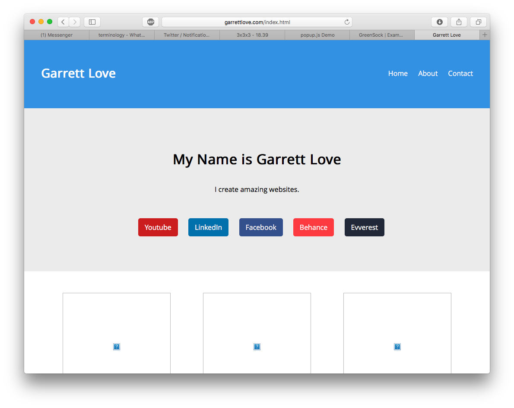

# garretthate

Have you ever gone to [garrettlove.com](http://garrettlove.com)? Usually, you will find a half-completed website design. I interpret [garrettlove.com](http://garrettlove.com) as a challenge. Whenever I get some free time, I will work on finishing the design that is currently on the site.

My latest copycat design will be available on [garretthate.com](http://garretthate.com).

# Current design

In my opinion, this was Garrett's best design. However, its implementation has many resizing issues which I addressed. In addition, I made some minor design improvements.

My current implementation has multiple pages and a "functioning" contact page. In particular, the contact page uses my server to send an asynchronous request to Garrett's contact page.

Garrett's current website looks like this:

